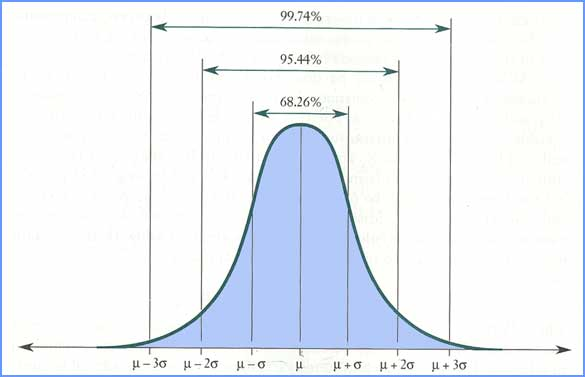
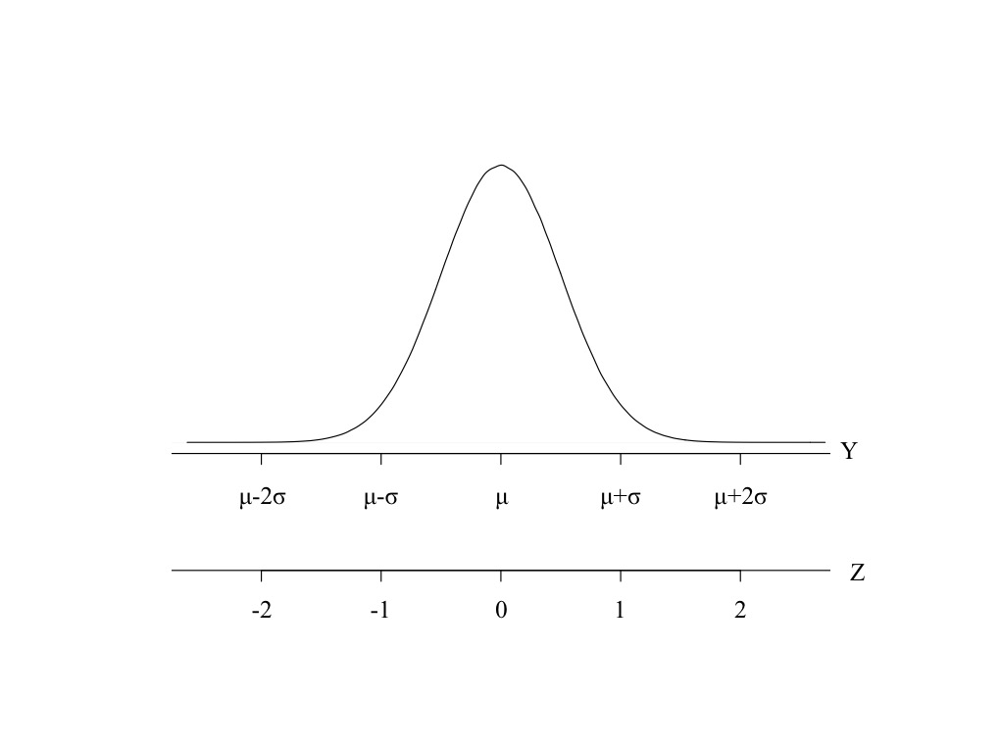
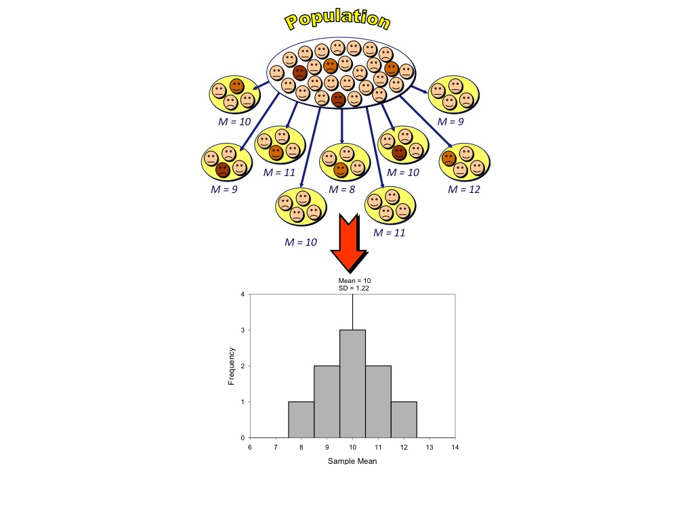

## What this chapter covers

- The nature of the Gaussian distribution
- SD and the Gaussian distribution
- The standard normal distribution
- The normal distribution does not define normal limits
- Why the Gaussian distribution is so central to statistical theory

## THE NATURE OF THE GAUSSIAN DISTRIBUTION
Symmetrical Bell-Shapped Distribution

```{r,echo=FALSE}
rm(list=ls())
options(stringsAsFactors=FALSE)

library(RColorBrewer)

x=seq(-5,5,by=0.1)
plot(x,dnorm(x),type="l",ylim=c(0,0.8),xlim=c(-5,5),ylab="Density",col=brewer.pal(3,"Set1")[1],lwd=3)
points(x,dnorm(x,mean=0,sd=0.5),type="l",col=brewer.pal(3,"Set1")[2],lwd=3)
points(x,dnorm(x,mean=0,sd=2),type="l",col=brewer.pal(3,"Set1")[3],lwd=3)
legend(2,0.8,legend=c("mean=0, SD=1","mean=0, SD=0.5","mean=0, SD=2"),col=brewer.pal(3,"Set1"),lwd=3)
```

##Many random factors
When many (independent) random factor contribute to an observed value, the observed values tend to follow Gaussian distribution.

```{r}
true_value = 10
e1 = runif(100000) - 0.5
e2 = runif(100000) - 0.5
e3 = runif(100000) - 0.5
e4 = runif(100000) - 0.5
e5 = runif(100000) - 0.5

values = true_value + e1 + e2 + e3 + e4 + e5
head(round(values,2))
tail(round(values,2))
```

##Result of many random factors contributing

```{r,echo=FALSE}
library(RColorBrewer)
hist(values,freq = FALSE,ylim=c(0,0.8))
points(seq(7,13,by=0.01),dnorm(seq(7,13,by=0.01),mean=mean(values),sd=sd(values)),type="l",col=brewer.pal(3,"Set1")[1],lwd=3)
```

##Common Statistical Tests and the Gaussian Distribution

Many commonly used statistical test rely on the assumption that the data being sampled from a population that follows a Gaussian distribution.

<br />

*This is often a reasonable assumption*.

##SD AND THE GAUSSIAN DISTRIBUTION
Ideal Gaussian Distribution In Terms of SD



##How well does the data fit this rule
```{r}
n = length(values)
sd1=sum(abs(values-mean(values))<(1*sd(values)))/n
sd2=sum(abs(values-mean(values))<(2*sd(values)))/n
sd3=sum(abs(values-mean(values))<(3*sd(values)))/n
```

**1 SD**:
simulated data set = `r paste(sprintf("%.2f",100*round(sd1,4)),"%",sep="")`
theoretical = 68.26%

**2 SD**:
simulated data set = `r paste(sprintf("%.2f",100*round(sd2,4)),"%",sep="")`
theoretical = 95.44%

**3 SD**:
simulated data set = `r paste(sprintf("%.2f",100*round(sd3,4)),"%",sep="")`
theoretical = 99.74%

##How well does the Gaussian distribution fit the LORR data
```{r,echo=FALSE}
input = "/Volumes/sabal/Teaching/CoSIBS/sleepTime.txt"
z = read.table(file=input,sep="\t",header=TRUE)
LORR = z$LORR

hist(LORR,freq = FALSE,ylim = c(0,0.02),xlim=c(0,160),breaks=8)
points(seq(0,160,by=1),dnorm(seq(0,160,by=1),mean=mean(LORR),sd=sd(LORR)),type="l",col=brewer.pal(3,"Set1")[1],lwd=3)
```

##How well does the Gaussian distribution fit the LORR data
```{r}
n = length(LORR)
st1=sum(abs(LORR-mean(LORR))<(1*sd(LORR)))/n
st2=sum(abs(LORR-mean(LORR))<(2*sd(LORR)))/n
st3=sum(abs(LORR-mean(LORR))<(3*sd(LORR)))/n
```

**1 SD**:
simulated data set = `r paste(sprintf("%.2f",100*round(st1,4)),"%",sep="")`
theoretical = 68.26%

**2 SD**:
simulated data set = `r paste(sprintf("%.2f",100*round(st2,4)),"%",sep="")`
theoretical = 95.44%

**3 SD**:
simulated data set = `r paste(sprintf("%.2f",100*round(st3,4)),"%",sep="")`
theoretical = 99.74%

##THE STANDARD NORMAL
**Standard Normal** - Gaussian distribution with mean = 0 and SD = 1

All Gaussian distributions can be converted to a standard normal distribution using the following formula:

$z = \frac{Value - Mean}{SD}$

*z* is the number of SD the value is away from the mean

##The standard normal distribution




##The standard normal distribution

Table 10.1 The standard normal distribution.
```{r,echo=FALSE}
library(knitr)
library(pander)
x = data.frame(z = c(0.6745,0.9672882,1,1.644854,1.96,2,2.576,3))
x$pct = sprintf("%0.2f",round(100*(1-(1 - pnorm(x$z))*2),2))
x$z = sprintf("%0.2f",round(x$z,2))
colnames(x) = c("z","PERCENTAGE OF STANDARD NORMAL DISTRIBUTION BETWEEN -z AND z")
```

```{r,echo=FALSE}
pander(x,align=rep("c",ncol(x)),row.names=FALSE,style="multiline")
```

##Calculate Table 10.1 in R

```{r}
z = c(0.67,0.97,1.0,1.65,1.96,2,2.58,3)
pct = 1-pnorm(z,lower.tail = FALSE)*2
round(pct*100,2)

## Taking z to 4 significant digits
z = c(0.6745,0.9673,1,1.645,1.96,2,2.576,3)
pct = 1-pnorm(z,lower.tail = FALSE)*2
round(pct*100,2)
```

##THE NORMAL DISTRIBUTION DOES NOT DEFINE NORMAL LIMITS

- Normal distribution does not equate to 'normal' range
- Defining the normal limits of a clinical measurement is not straightforward and requires clinical thinking, not just statistics

##WHY THE GAUSSIAN DISTRIBUTION IS SO CENTRAL TO STATISTICAL THEORY

- The Central Limit Theorem states that regardless of the distribution of the population, if the number of observations is large enough (typically 30 or greater) , then the sampling distribution of the sample mean is at least APPROXIMATELY normal (i.e., Gaussian).

- This is an extremely important theorem!  It allows us to use statistical inference based on the normal distribution for statistics where the sample size is relatively large.

##Sampling Distribution of the Sample Mean

- **Sampling variation** is the concept that (random) samples from the same population will differ because they contain different members of the population.
- **Sampling distribution** is the frequency distribution of the statistics resulting from all possible samples (of a certain size n) from the same population.
- Example:  Suppose we could get ratings of all statistics instructors in the world and that the population mean rating (on a scale from 1 to 20) is $\mu$=10.  We take several random samples of size n=4 and calculate the sample mean.  What is the distribution of the sample means?

##Sampling Distribution of the Sample Mean



##What did we learn

- The Gaussian bell-shaped distribution is the basis for much of statistics.  It arises when many random factors create variability.
- The Gaussian distribution is also called a normal distribution. But this use of normal is very different than the usual use of that word to mean ordinary or abundant.
- The central limit theorem explains why Gaussian distributions are central to much of statistics.
