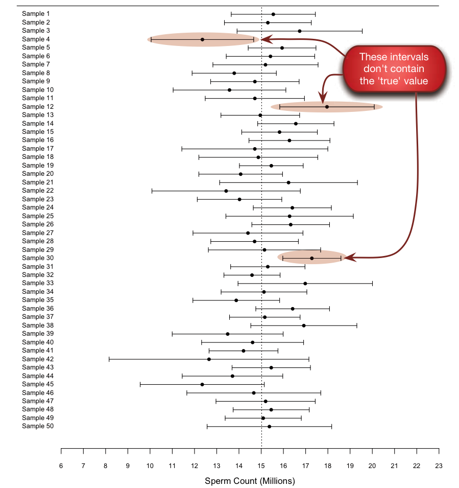

##What this chapter covers

- Interpreting a CI of a mean
- What values determine the CI of a mean
- Assumptions: CI of a mean
- How to calculate the CI of a mean
- More about confidence intervals

##INTERPRETING A CI OF A MEAN
- A **confidence interval** is a range of values in which we think the value of a population parameter falls.
- The **confidence level** of a confidence interval is the probability that confidence intervals built using an appropriate method will contain the population parameter.
    - This probability is not for a specific interval but for the intervals in general.
    - A specific interval will either contain the population parameter or it will not – the probability is 0 or 1.
    - The totality of intervals containing the population parameter will match the confidence level.
    
##Illustrative example for interpreting CI
- Suppose that the true mean amount of sperm released by male Japanese quail is 15 million sperm.  
- Suppose we take a random sample of male Japanese quail and measure the amount of sperm they release and construct a 95% confidence interval.  
- Say the interval ranges from 12 million to 22 million sperm.  This interval contains the true mean value.  
- Suppose we repeat the experiment 49 more times and construct 95% confidence intervals.  
- About 95% of the intervals (2 to 3 of the 50 intervals) will contain the true mean number of sperm and about 5% will not.  

##Illustrative example for interpreting CI


##R code for calculating confidence interval

```{r}
values = c(29, 35, 32, 41, 30)
t.test(values)
```

##Age Guessing Example
Population Distributions
```{r,echo=FALSE}
library(RColorBrewer)
ageGuess = read.table(file="~/Documents/Teaching/BIOS6670 - CoSIBS/ageGuess.2017-07-12.txt",sep="\t",header=TRUE)
plot(density(ageGuess$Bruce.Benson),xlim=c(20,90),lwd=3,col=brewer.pal(3,"Set1")[1],xlab="age (years)",main="",ylim=c(0,0.12))
points(density(ageGuess$Don.Cheadle),type="l",lwd=3,col=brewer.pal(3,"Set1")[2])
points(density(ageGuess$Stranger),type="l",lwd=3,col=brewer.pal(3,"Set1")[3])

age_range = seq(20,90,by=1)
points(age_range,dnorm(age_range,mean=mean(ageGuess$Bruce.Benson),sd=sd(ageGuess$Bruce.Benson)),type="l",lwd=3,col=brewer.pal(3,"Set1")[1],lty=2)
points(age_range,dnorm(age_range,mean=mean(ageGuess$Don.Cheadle),sd=sd(ageGuess$Don.Cheadle)),type="l",lwd=3,col=brewer.pal(3,"Set1")[2],lty=2)
points(age_range,dnorm(age_range,mean=mean(ageGuess$Stranger),sd=sd(ageGuess$Stranger)),type="l",lwd=3,col=brewer.pal(3,"Set1")[3],lty=2)

legend(20,0.12,legend=c("Benson - Observed","Benson - Normal","Cheadle - Observed","Cheadle - Normal","Stranger - Observed","Stranger - Normal"),col=rep(brewer.pal(3,"Set1"),each=2),lwd=3,lty=c(1,2,1,2,1,2))
```

##Age Guessing Example

```{r}
summary(ageGuess$Don.Cheadle)
summary(ageGuess$Bruce.Benson)
summary(ageGuess$Stranger)
```

##Calculating many confidence intervals
```{r}
set.seed(8392789)
num_random = 100
pop_mean = mean(ageGuess$Don.Cheadle)

all.ci = data.frame()
for(i in 1:num_random){
  random_sample = sample(ageGuess$Don.Cheadle,5,
                         replace=TRUE)
  ci = t.test(random_sample)$conf.int
  all.ci = rbind(all.ci,ci)
}

all.ci$contains_pop_mean = all.ci[,1]<pop_mean & 
  all.ci[,2]>pop_mean
sum(all.ci$contains_pop_mean)/nrow(all.ci)
```
##Plot All CI
```{r,eval=FALSE}
for (i in 1:nrow(all.ci)){
  x = as.numeric(all.ci[i,1:2])
  y = c(i,i)
  color = c("red","black")[all.ci$contains_pop_mean[i]+1]
  if(i==1) plot(x,y,
                type="l",
                ylim=c(0,nrow(all.ci)+1),
                xlim = c(min(all.ci[,1]),max(all.ci[,2])),
                col=color)
  if(i!=1) points(x,y,
                  type="l",
                  col=color)
}
abline(v=pop_mean)
```

##Plot All CI
```{r, echo=FALSE}
for (i in 1:nrow(all.ci)){
  x = as.numeric(all.ci[i,1:2])
  y = c(i,i)
  if(i==1) plot(x,y,ylim=c(0,nrow(all.ci)+1),type="l",xlim = c(min(all.ci[,1]),max(all.ci[,2])))
  if(i!=1) points(x,y,type="l",col=c("red","black")[as.numeric(all.ci$contains_pop_mean[i])+1])
}
abline(v=pop_mean)
```

##WHAT VALUES DETERMINE THE CI OF A MEAN
1. **Sample Mean**. Estimate of population mean and center of CI
2. **SD**.  The SD is proportional to the width of the CI
3. **Sample Size**.  The sample size is inversely proportional to the width of the CI
4. **Degree of Confidence**. The confidence level of the interval, usually 95%. As the degree of confidence increase, the width of the CI increases

##ASSUMPTIONS: CI OF A MEAN
1. Random (or representative) sample
2. Independent observations
3. Accurate data
4. Assessing an event that you really care about
5. The population is distributed in a Gaussian manner, at least approximately

##What if an assumption is violated

- In many situations, these assumptions are not strictly true.
- If an assumption is violated, the CI will probably be too optimistic (too narrow).

##HOW TO CALCULATE THE CI OF A MEAN

$W$ = margin of error of the CI

$t*$ = constant from the *t* distribution

$s$ = sample standard deviation

$n$ = number of values in the sample

$m$ = sample mean

${W=\frac{t*\times s}{\sqrt{n}}}$

CI: $m-W$ to $m+W$

##Demonstration of CI formula in R

```{r}
m = mean(ageGuess$Don.Cheadle)
s = sd(ageGuess$Don.Cheadle)
n = length(ageGuess$Don.Cheadle)
cl = 0.95

#Constant from the t distribution
t_star = qt(p=1 - (1-cl)/2,df=n-1)

#Margin of error of the CI
W = t_star*s/sqrt(n)

#CI
c(m-W,m+W)
```

##Confidence interval from t.test function
```{r}
t.test(ageGuess$Don.Cheadle)
```

##MORE ABOUT CONFIDENCE INTERVALS
One-sided CIs:

```{r}
m = mean(ageGuess$Don.Cheadle)
s = sd(ageGuess$Don.Cheadle)
n = length(ageGuess$Don.Cheadle)
cl = 0.95

#Constant from the t distribution
t_star = qt(p=cl,df=n-1)
#Margin of error of the CI
W = t_star*s/sqrt(n)
#CI
m+W
```
95% confidence that the population mean is less than `r round(m+W,1)`

##Other Types of CI
**CI of the SD**

- A CI value can be determined for nearly any value you calculate from a sample of data.
- The CI of the SD can be calculated using the Chi-Square distribution 

**CI of the Geometric Mean**

- Calculate confidence interval on the logged data
- Take the antilog of the estimated CI

##The CI and the SEM

Standard error of the mean (SEM) = $s/\sqrt(n)$

Margin of error of CI (W) = $t*\times SEM$

##What did we learn
1. A confidence interval of the mean shows you how precisely you have determined the population mean.
2. If you compute 95% confidence intervals from many samples, you expect that 95% will include the true population mean and 5% will not.
3. The CI of the mean is computed from the sample mean, the sample SD, and the sample size.
4. The CI does NOT display the scatter of the data.
5. As the confidence level increases, the CI will be larger.
6. Larger samples have narrower confidence itnervals than smaller samples with the same SD.
