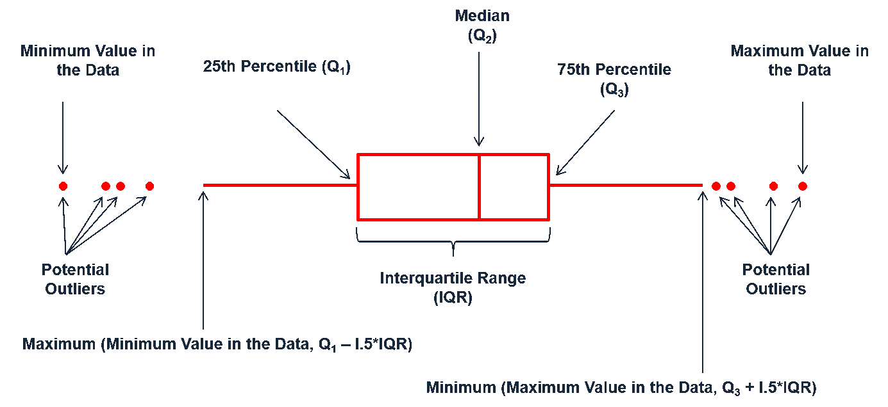

What this chapter covers
========================================================

- Mean and Median
- Error, Bias, Precision, and Percentiles
- Graphing data to show scatter
- Beware of data massage

Mean
========================================================

- one of the most common statistics calculated on any data set (right or wrong)
- arithmetic mean = average
- mean = $\frac{\sum\limits_{i = 1}^N {x_i}}{N}$

Arithmetic Mean in R
========================================================

Table 7.1.  The body temperature of 12 individuals in degrees centigrade.
Motulsky 2014 p. 62

```{r}
bodyTemp = c(37.0,36.0,37.1,37.1,36.2,37.3,
             36.8,37.0,36.3,36.9,36.7,36.8)
```

Calculate Arithmatic Mean Via Formula
==============

```{r}
# via formula
sum(bodyTemp) / length(bodyTemp)
```


Calculate Arithmatic Mean Via Function in Base R
==============

```{r}
# via base function
mean(bodyTemp)

# with rounding to match book
round(mean(bodyTemp),2)
```


Potential Outlier Effect on Mean
==========
```{r}
bodyTemp2 = c(37.0,36.0,37.1,371,36.2,37.3,
             36.8,37.0,36.3,36.9,36.7,36.8)
mean(bodyTemp2)
```


Median
==================
Often, we want a measure of the central tendency that is more robust to outliers than the mean.

- median = middle value = 50th percentile
- if even number of sample, take of average of the two middle ones
  - e.g., for body temperature (N = 12), take the average the 6th and 7th ranked values
  
Ranking data in R
================
```{r}
ranked.bodyTemp = bodyTemp[order(bodyTemp)]
#OR
ranked.bodyTemp = sort(bodyTemp)

ranked.bodyTemp
```

Median Using Formula
================

```{r}
ranked.bodyTemp[6:7]
(ranked.bodyTemp[6] + ranked.bodyTemp[7])/2
```

Median Using Function in Base R
================
```{r}
median(bodyTemp)

## With outlier (typo)
median(bodyTemp2)
```


Geometric Mean
==============
Another central measure that is more robust to outliers or 'skewed' distributions is the **geometric mean**.

- geometric mean =  $\exp\left[\frac1n\sum_{i=1}^n\ln x_i\right]$
- to be able to calculate the geometric mean, all values must be greater than zero

Geometric Mean Using Formula
================

```{r}
## Step 1 - take log of values
logged.bodyTemp = log(bodyTemp)

## Step 2 - average logged values
avg.logged.bodyTemp = mean(logged.bodyTemp)

## Step 3 - take antilog of average of logged values
geoMean.bodyTemp = exp(avg.logged.bodyTemp)
geoMean.bodyTemp
```

Geometric Mean - Creating a Function
================

```{r}
gm = function(a) exp(mean(log(a)))
gm(bodyTemp)
```

Geometric Mean - Type of Log
================
It doesn't matter if you use a natural log, log base 10, log base 2, etc.

```{r}
exp(mean(log(bodyTemp)))
10^(mean(log10(bodyTemp)))
2^(mean(log2(bodyTemp)))
1.234^(mean(log(bodyTemp, 1.234)))
```


Harmonic Mean
===========
Not commonly used, the **harmonic mean** is similar to the geometric mean, in that the values are tranformed then averaged and then averaged value is reverse transformed.

- harmonic mean = $\left[\frac1n\sum_{i=1}^n \frac1x_i\right]^{-1}$
- to be able to calculate the harmonic mean, all values must be greater than zero

Harmonic Mean Using Formula
================

```{r}
## Step 1 - take reciprocal of values
recip.bodyTemp = 1/bodyTemp

## Step 2 - average reciprocal values
avg.recip.bodyTemp = mean(recip.bodyTemp)

## Step 3 - take reciprocal of the average
##          of reciprocal values
harmMean.bodyTemp = 1/avg.recip.bodyTemp
harmMean.bodyTemp
```

Harmonic Mean - Creating a Function
================

```{r}
hm = function(a) 1/(mean(1/a))
hm(bodyTemp)
```

Trimmed Mean
==========
Often, we don't want to include the extreme values in the measure of central tendency.  In that case, a **trimmed  mean** is often used.

- trimmed mean = mean of most of the values, ignoring the highest and lowest values

Trimmed Mean Using Formula
================

```{r}
## Step 1 - reduce to interquartile range, 
##    i.e., remove bottom 25% and top 25%
ll = quantile(bodyTemp,0.25)
ul = quantile(bodyTemp,0.75)
iqr.bodyTemp = bodyTemp[bodyTemp>=ll & bodyTemp<=ul]

## Step 2 - average values in the interquartile range
trimmed.bodyTemp = mean(iqr.bodyTemp)
trimmed.bodyTemp
```

Trimmed Mean - Using a Function
================

```{r}
mean(bodyTemp,trim=0.25)
```

Mode
=====
Rather than the mean, we might want to know what is most likely value.  In that case, you would report the **mode** instead.

- mode = the value(s) that occurs most often
- usually only relevant if the values are integers or a number with only one or two significant digits
- a data set can have more than one mode

Mode by hand
=======

```{r}
(cnts = table(bodyTemp))
(max.cnts = cnts[cnts==max(cnts)])
names(max.cnts)
```

Mode - Creating Function
=======

```{r}
modeDist = function(a){
  cnts = table(a)
  max.cnts = cnts[cnts==max(cnts)]
  output = names(max.cnts)
  return(output)
}

modeDist(bodyTemp)
```

Comparison of Central Tendency Measures of Body Temperature
===========

```{r,echo=FALSE}
library(knitr)
orig = data.frame(type=c("arithematic mean","median","geometric mean","harmonic mean","trimmed mean (25% from either end)","mode"),value=c(round(mean(bodyTemp),2),round(median(bodyTemp),2),round(gm(bodyTemp),2),round(hm(bodyTemp),2),round(mean(bodyTemp,trim=0.25),2),paste(modeDist(bodyTemp),collapse=", ")))

altered = data.frame(type=c("arithematic mean","median","geometric mean","harmonic mean","trimmed mean (25% from either end)","mode"),value=c(round(mean(bodyTemp2),2),round(median(bodyTemp2),2),round(gm(bodyTemp2),2),round(hm(bodyTemp2),2),round(mean(bodyTemp2,trim=0.25),2),paste(modeDist(bodyTemp2),collapse=", ")))
```
Original Data Set
```{r, results='asis',echo=FALSE,eval=TRUE}
kable(orig,align=rep("c",ncol(orig)),row.names=FALSE)
```

Comparison of Central Tendency Measures of Body Temperature
===========
Data Set with Typo
```{r, results='asis',echo=FALSE,eval=TRUE}
kable(altered,align=rep("c",ncol(altered)),row.names=FALSE)
```

ERROR, BIAS, PRECISION, AND PERCENTILES
=========================================

Error
======
With respect to data values, error is often used to the describe the variation between data values.  This can include:

- biological variation
- experimental error, i.e., imprecision
- technical error, e.g., typos

Statisticians tend to prefer the terms **scatter** or **variability** rather than error.

Bias
======
When the error is systematic, it is referred to as **bias**.  "Systematic" indicates that the added error affects each value in a similar manner, e.g.,

- faulty thermometer
- bug in code that converts degrees Celsius to degrees Fahrenheit

Bias data are NOT **accurate**.

*Accuracy - the proximity of measured values to the true value

Precision
========
**Precision** is a measure of how reproducible the measured values are, i.e., little scatter.


Precision and accuracy are independent, e.g., your measurements can have little scatter, but a large bias.

***


Percentiles
===========
The *X* th percentile is the measured value with *X* % of the values less than its value.

```{r}
quantile(bodyTemp)
sum(bodyTemp<quantile(bodyTemp)[2])
sum(bodyTemp<quantile(bodyTemp)[2])/length(bodyTemp)
```

GRAPHING DATA TO SHOW SCATTER OR DISTRIBUTION
============================

Scatterplots
=========
Scatterplots are used to display every data point.  This makes it easy to:

- find outliers
- get a general idea of scatter
- estimate median and possibly mean

***

```{r,echo=FALSE}
plot(jitter(rep(0,length(bodyTemp)),amount=0.05),
     bodyTemp,xlim=range(-1,1),pch=20,ylim=range(35.5,37.5),
     axes=FALSE,frame.plot=TRUE,xlab="",cex=2)
axis(2, seq(35.5,37.5,by=0.5))
segments(-0.2, mean(bodyTemp), 0.2, mean(bodyTemp), lwd=3)
```

Scatterplots - Lots of data
=============


When you have lots of data points, the utility of the scatter plot diminishes.
```{r,echo=FALSE}
set.seed(283947)
bigData = rnorm(130,mean=mean(bodyTemp),sd=sd(bodyTemp))
```


***

```{r,echo=FALSE}
set.seed(283947)
bigData = rnorm(130,mean=mean(bodyTemp),sd=sd(bodyTemp))
plot(jitter(rep(0,length(bigData)),amount=0.25), bigData,xlim=range(-1,1),pch=20,ylim=range(35.5,38.5),axes=FALSE,frame.plot=TRUE,xlab="",cex=2)
axis(2, seq(35.5,38.5,by=0.5))
segments(-0.5, mean(bigData), 0.5, mean(bigData),lwd=3)
```

Scatterplot - Example Code
========
```{r,eval=FALSE}
plot(jitter(rep(0,length(bodyTemp)),amount=0.05), 
     bodyTemp,
     xlim=range(-1,1),
     ylim=range(35.5,37.5),
     axes=FALSE,
     frame.plot=TRUE,
     xlab="",
     pch=20,
     cex=2)
axis(2, seq(35.5,37.5,by=0.5))
segments(-0.2, mean(bodyTemp), 0.2, mean(bodyTemp), lwd=3)
```


Box-and-whisker plots
====================
Box-and-whisker plots, or just box plots, give you an idea about the distribution of the data without plotting every single point.


Box-and-whisker plots - Body Temperature
==================
```{r,echo=FALSE}
boxplot(bodyTemp,main="Original Data",cex=2)
```

***

```{r,echo=FALSE}
boxplot(bodyTemp2,main="With Outlier",cex=2)
```

Box-and-whisker plot - R Code
====================
```{r}
boxplot(bodyTemp,main="Original Data",cex=2)
```

Box-and-whisker plot - WARNING
====================
Not all program/people use the same definitions for where whiskers should end.  Some use:

- 5% and 95% percentiles
- maximum and minimum values


Always double check the programs documentation for details.
You can change most of these properties in the boxplot R function, e.g., range option

Frequency distribuiton histograms
================================
When there is a lot of data points or if you want to identify a mode, a histogram is helpful.

***

```{r}
hist(bigData)
```

Histograms - Breakpoints
================================

```{r,eval=FALSE}
par(mfrow=c(2,2))
hist(bigData,breaks=5)
hist(bigData,breaks=10)
hist(bigData,breaks=20)
hist(bigData,breaks=40)
```

***

```{r,echo=FALSE}
par(mfrow=c(2,2))
hist(bigData,breaks=5)
hist(bigData,breaks=10)
hist(bigData,breaks=20)
hist(bigData,breaks=40)
```

Cumulative frequency distribution
==========================
```{r}
par(mfrow=c(1,1))
plot(ecdf(bigData),ylab="cumulative percent")
```

BEWARE OF DATA MASSAGE
=====================

Often publications include graphics that do not contain the data that was actually collected.

Beware of:

- filtering out impossible data (e.g., a child older than their parent, smoker that smokes more than 100 packs a day)
- adjusted data (e.g., values adjusted for different demographics of sample)
- smoothing (e.g., making plots pretty)
- variables that are the ratio of two measurements (e.g., enzyme activity by cell count)
- normalized data (e.g., calculated percents)

What did we learned
=====
- Continuous variables are common in medical research.
- Several ways to determine the central tendency of data (mean, median, mode, geometrical mean, harmonic mean).
- Graphics to consider: 
  (1) scatter plot (smaller number of values) 
  (2) box plot (larger number of values) 
  (3) histograms (details about shape of distribution) 
  (4) cumulative distribution
- 'Final' graphics are often massaged, be wary.
